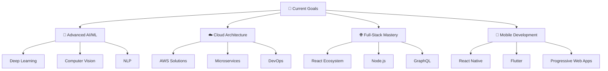

<h1 align="center">👋 Welcome to My Digital Universe</h1>

  
  
  

  
  
  

---

## 🎯 About Me

**AI Innovator & Full-Stack Developer** passionate about building tomorrow's technology today.

- 🔭 Currently working on **AI/ML projects** and **full-stack applications**
- 🌱 Learning advanced **machine learning** and **cloud technologies**
- 👯 Looking to collaborate on **open source projects**
- 💬 Ask me about **AI, Web Development, and Tech Innovation**
- 📫 How to reach me: **[Your Email]**
- ⚡ Fun fact: **I turn coffee into code and ideas into reality!**

## 🎯 About Me

🎓 **Final-year B.Tech** in **Artificial Intelligence & Data Science**  
🚀 **Passionate** about **Machine Learning, Full-Stack Development & Scalable Systems**  
💡 **Building** practical AI solutions that make a real-world impact  
🌟 **Open Source** enthusiast always ready to collaborate  
🎯 **Mission**: Bridging the gap between cutting-edge AI and user-centric applications

 

---

## 🛠️ Tech Arsenal

### 💻 Languages & Core Technologies

### 🤖 AI/ML & Data Science

### 🌐 Web Development

### 🗄️ Databases & Cloud

### 🛠️ DevOps & Tools

---

## 🚀 Featured Projects

### 🔥 **Project Showcase**

<table>
<tr>
<td width="50%">

### 🚚 **Vehicle Routing Optimization**
**Tech Stack**: `Python` `DEAP` `Streamlit` `Google Maps API`

- 🎯 **30% reduction** in fuel costs for 100+ delivery nodes
- 🗺️ Real-time route optimization with Google Maps integration
- 📊 Interactive dashboard for logistics management
- 💰 **Impact**: Simulated savings of **₹4.2L** in logistics costs

**[🔗 View Project](https://github.com/naveencreation)**

</td>
<td width="50%">

### 🤖 **AutoML Predictive Framework**
**Tech Stack**: `TensorFlow` `Scikit-learn` `Optuna` `SHAP`

- 🎯 **89% accuracy** with automated hyperparameter tuning
- 🔍 Explainable AI with SHAP value integration
- ⚡ **40% faster** preprocessing pipeline
- 📈 End-to-end ML pipeline automation

**[🔗 View Project](https://github.com/naveencreation)**

</td>
</tr>
<tr>
<td width="50%">

### 🏥 **Medico Plus Healthcare Platform**
**Tech Stack**: `Django` `React` `MongoDB` `Docker` `JWT`

- 🌐 Multilingual support (English + Tamil)
- 🔐 Secure patient-doctor interaction APIs
- 🐳 Fully containerized deployment
- ⚡ **65% faster** appointment booking

**[🔗 View Project](https://github.com/naveencreation)**

</td>
<td width="50%">

### 🏃 **Human Activity Recognition**
**Tech Stack**: `Python` `PCA` `K-Means` `t-SNE`

- 📊 Compressed **561 → 50 features** with **81% accuracy**
- 🎯 **F1-score: 0.84** on HAR dataset
- 📈 Advanced dimensionality reduction techniques
- 🔍 Interactive cluster visualization

**[🔗 View Project](https://github.com/naveencreation)**

</td>
</tr>
</table>

---

## 📊 GitHub Analytics

  
  

  
  
  

  

---

## 🧩 Coding Achievements

### 🏆 **LeetCode Performance**

### 🎖️ **Certifications**

---

## 🌟 GitHub Contribution

  

  

---

## 🎯 Current Focus

```mermaid
graph TD
    A[🎯 Current Goals] --> B[🤖 Advanced AI/ML]
    A --> C[☁️ Cloud Architecture]
    A --> D[🌐 Full-Stack Mastery]
    A --> E[📱 Mobile Development]
    
    B --> B1[Deep Learning]
    B --> B2[Computer Vision]
    B --> B3[NLP]
    
    C --> C1[AWS Solutions]
    C --> C2[Microservices]
    C --> C3[DevOps]
    
    D --> D1[React Ecosystem]
    D --> D2[Node.js]
    D --> D3[GraphQL]
    
    E --> E1[React Native]
    E --> E2[Flutter]
    E --> E3[Progressive Web Apps]
```

---

## 🤝 Let's Connect & Collaborate

### 🌐 **Find Me Online**

### 💬 **Let's Build Something Amazing Together!**

  

---

  

### ⭐ **If you like my work, please consider giving a star to my repositories!** ⭐

